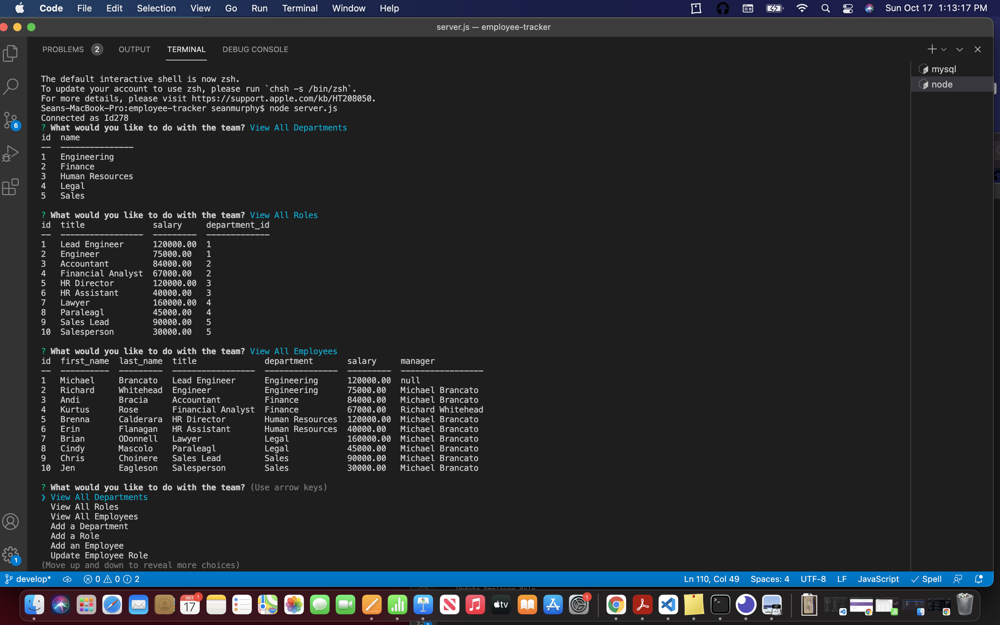

# Employee-tracker-CMS

## Description

This application is a CMS, or Content Management System, to help create and keep track of employees for a business. This application uses Node.js and MySql database to help organize the employees and help update if they have to. The information is put in and then it is help shown to people through the console.table NPM package. With the proper storage of data for the employees, a business can run smoothly and also be helpful to show all the information that an employee may need. A mom and pop shop can use this, or a giant business should be able to track the employee data and find it useful. 

For a quick user start guide to use this application, just click on the link: 
https://drive.google.com/file/d/1DEt05QVN-ADyeXHbY2vImpuFs5cU2ZYg/view
This will be helpful in starting the project off on the right foot!

## Table of Contents

* [Installation](#installation)
* [Usage](#usage)
* [License](#license)
* [Technology](#technology)
* [Credits](#credits)
* [Contact](#contact)

## Installation

To install this application you must have a few things on your computer. You must have node.js and MySql install on your computer. Once these are installed, follow these steps to success!

1. At the repo for this project hit the green code button.

2. Click on the SSH Key and copy that link.

3. Make sure you are in a new folder on your desktop and open terminal.

4. Navigate to the new folder and type in "git clone" and then paste the link that you copied from the SSH key. 

5. Go into the folder and go to the root folder of the project. 

6. While there type in 'npm install", that will allow the dependencies that you need to download and you can run the application. 

7. Once the dependencies are installed, you are still in the root folder, type in "mysql -u root -p" and you must enter in your password.

8. When you have entered in the beginning of the Terminal will have mysql and then you can type in "source db/schema.sql". This wording will allow the user to create a the database "employees_db" and the tables that correspond with the database. 

8. The next command to run is "source db/seeds.sql". This takes the information in the seeds file and inserts it into the tables from teh schema.sql file. 

## Usage

To use the application 

1. Open Terminal or Git bash, and make sure you are in the root folder for the repo.

2. Go into the  server.js file and insert the password you used for MySql under the password section. 

3. Now that you have changed the password, you can run the command "node server.js". This will start the application.

4. The prompts in the terminal are now there for you to inspect and change. 

5. If there are issues with the prompts and you receive an error message, you can hit the "control" and "c" button at the same time and that will exit the application and you can start again by running "node server.js".

6. If any questions, comments, or concerns you can go to the video above with any questions. OR feel free to email me at the link down below!

## License 

MIT license

## Technology

* MySql
* Node.js 
* Javascript
* VS Code
* Git

## Credits

* UCONN Coding Bootcamp

## Contact

- [Github](https://github.com/smurphy7326)
- [Email](mailto:smurphy7326@gmail.com)